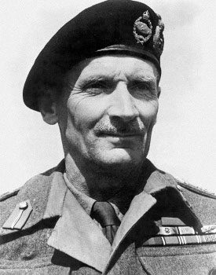

Montgomery
==========

Come back later, this is still alpha code !

Montgomery is a tool to generate code to serialize/marshal/transform
from one source type to a destination type.  We generate code because
it makes super fast serializer and much less terse than runtime
attribute analysis (the generated code is quite readable). Right now
Montgomery is wired to work with
SQLAlchemy_, but nothing prevents it to
work on other structured data.

.. SQLALchemy: http://www.sqlalchemy.org/

The way to choose the fields to serialize is implemented by another
class, the walker. Right now, the only walker we provide is one that
uses the "natural" structure of an SQLAlchemy mapper. Besides, the
source type and destination types can be : regular SQLAlchemy mappers,
plain objects and plain dicts. If you need to output JSON, then
you can convert the dicts to JSON.

Montgomery makes it easy to generate code to serialize in both
directions (e.g. from, say, object to dicts and vice versa).

Montgomery is called like that because there was a great field
marshal.

